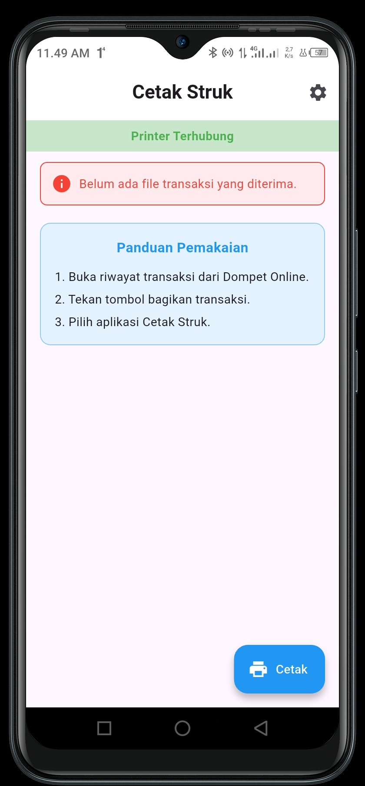
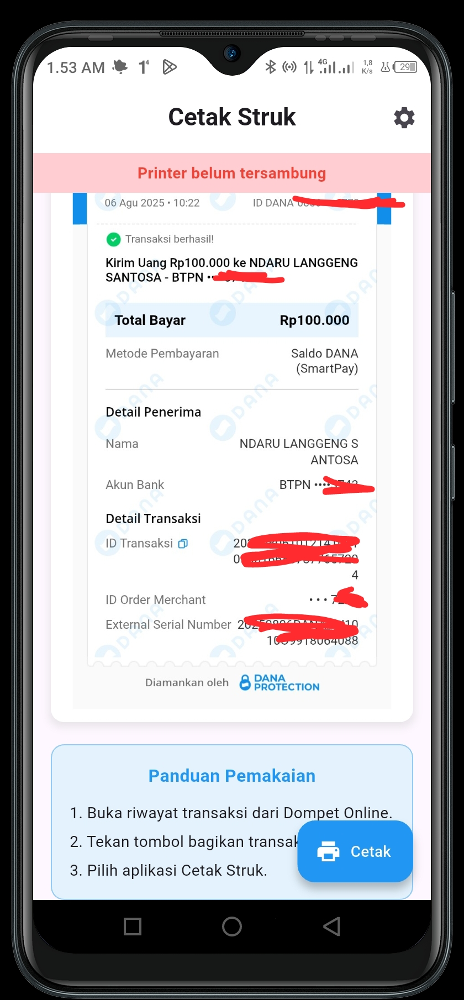
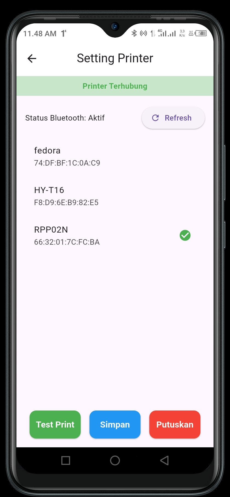
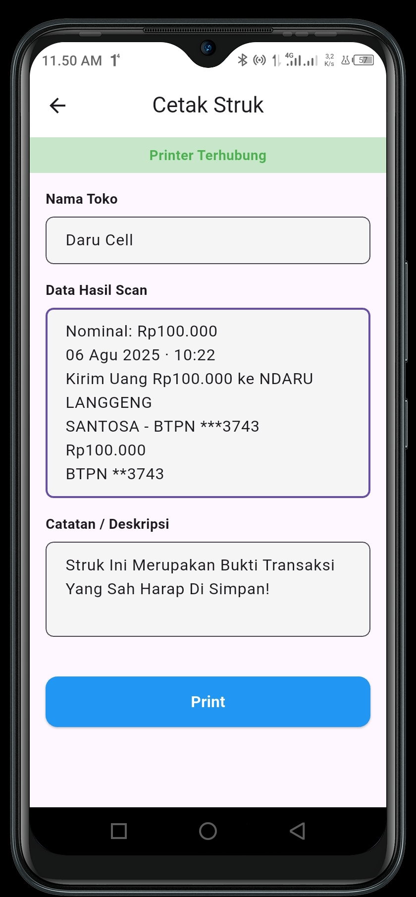
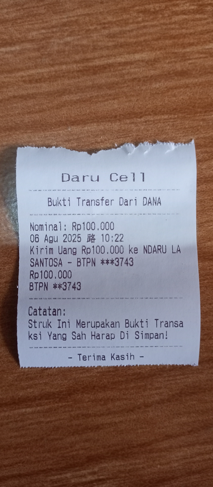

# Konter Print Helper


> **Solusi Cetak Struk Digital ke Thermal Printer dalam Sekali Klik.**

Aplikasi utilitas cerdas untuk pemilik **Konter Pulsa & PPOB**. Mengubah bukti transaksi digital (screenshot) menjadi struk fisik yang rapi, tajam, dan hemat kertas menggunakan teknologi OCR dan Integrasi Android Share Intent.

---

## Tampilan Aplikasi
| Homepage | Hasil Scan (OCR) | Setting Printer | Preview Cetak | Hasil Cetak |
|:---:|:---:|:---:|:---:|:---:|
|  |  |  |  |  |

---

## Masalah & Solusi
| Masalah X | Solusi Kami ✓ |
| :--- | :--- |
| **Gambar Buram:** Cetak langsung membuat teks pecah/blur. | **Teks Tajam:** Menggunakan OCR untuk mengambil teks asli, bukan gambar. |
| **Boros Kertas:** Banyak whitespace/ruang kosong pada sistem bawaan (gopay/dana/seabank). | **Hemat Kertas:** Layout struk dipadatkan khusus untuk kertas 58mm. |
| **Ribet:** Harus save gambar -> buka galeri -> cari app printer. | **Cepat:** Cukup tekan tombol **"Share"** langsung dari E-Wallet. |

## Fitur Unggulan
* **Direct Share Integration**
    Tidak perlu buka tutup aplikasi. Aplikasi ini otomatis muncul di menu "Share/Bagikan" Android.
* **Smart OCR Engine**
    Didukung oleh **Google ML Kit** untuk akurasi pembacaan teks yang tinggi.
* **Auto-Parser (Smart Detection)**
    Otomatis memisahkan data penting (Nominal, Penerima, Pengirim) dari teks sampah.
* **Editable Struk**
    Typo pada OCR? Anda bisa mengedit teks sebelum dicetak.
* **Universal Bluetooth Printer**
    Mendukung hampir semua merek printer thermal Bluetooth (ESC/POS) ukuran 58mm & 80mm.

## Aplikasi Teruji (Supported Apps)
Sistem parser kami telah dioptimalkan untuk membaca struk dari:
- [x] **DANA** (Kirim Uang & Pembayaran)
- [x] **GoPay** (Transfer & Top Up)
- [x] **SeaBank** (Transfer Antar Bank)
- [ ] *OVO (Coming Soon)*
- [ ] *BRImo (Coming Soon)*

## Tech Stack
* **Core:** [Flutter](https://flutter.dev) (Dart)
* **Native Integration:** Android Method Channel (Share Intent)
* **AI/ML:** [google_mlkit_text_recognition](https://pub.dev/packages/google_mlkit_text_recognition)
* **Hardware:** [blue_thermal_printer](https://pub.dev/packages/blue_thermal_printer)
* **State Management:** Provider

## Cara Penggunaan (Workflow)
1.  **Transaksi:** Selesaikan transaksi di E-Wallet (misal: DANA).
2.  **Bagikan:** Tekan tombol **Share / Bagikan Resi**.
3.  **Pilih App:** Pilih icon **"Konter Print"**.
4.  **Proses:** Aplikasi terbuka -> Gambar di-scan -> Data muncul.
5.  **Cetak:** Edit jika perlu, lalu tekan **Print**.

## Instalasi & Pengembangan
Pastikan Anda sudah menginstall Flutter SDK.

```bash
# 1. Clone repository
git clone https://github.com/Ndaru244/konter-print-helper.git

# 2. Masuk ke direktori project
cd konter-print-helper

# 3. Install library
flutter pub get

# 4. Jalankan (Wajib menggunakan Device Fisik untuk fitur Bluetooth)
flutter run
