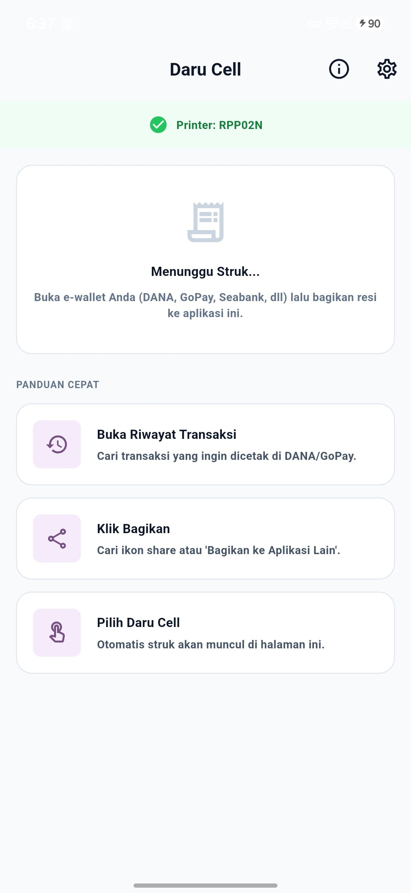
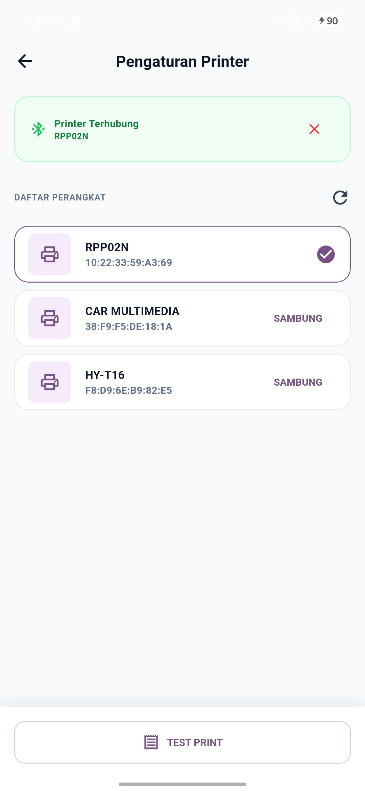

# Konter Print Helper

Aplikasi Android (Flutter) untuk **konter pulsa / PPOB**: ubah bukti transfer atau token PLN dari e-wallet (DANA, GoPay, SeaBank, dll.) menjadi struk fisik di **printer thermal Bluetooth**, lewat share intent + OCR.

## Isi aplikasi

- **Home** — menunggu resi yang dibagikan dari e-wallet
- **Printer** — tab bawah: sambung Bluetooth, test print
- **Pengaturan** — tentang, privasi, lisensi, versi
- **Edit Struk** — OCR → form Transfer / PLN Token / Lain (bisa dikoreksi), termasuk **total bayar** (nominal + admin konter)
- **Cetak** — template padat untuk kertas thermal; token PLN satu baris ukuran besar

**Stack:** Flutter · Google ML Kit Text Recognition · `blue_thermal_printer` · Provider

## Tampilan

| Home | Edit Struk | Printer | Hasil cetak |
|:---:|:---:|:---:|:---:|
|  |  |  |  |

## Cara menjalankan

Butuh Flutter SDK dan device Android (Bluetooth lebih baik di device fisik).

```bash
git clone https://github.com/Ndaru244/konter-print-helper.git
cd konter-print-helper
flutter pub get
flutter run
```

Build APK:

```bash
flutter build apk --release
```

APK: `build/app/outputs/flutter-apk/app-release.apk` — atau unduh di [Releases](https://github.com/Ndaru244/konter-print-helper/releases).

## Versi

Ubah nomor hanya di `pubspec.yaml` (`version: X.Y.Z+N`). Layar Tentang dan Pengaturan membaca angka itu lewat `package_info_plus`, jadi tidak perlu menulis versi di kode UI.

## Privasi

Gambar resi dan teks struk diproses di perangkat. Nama toko dan printer yang dipilih tersimpan di HP. Aplikasi tidak mengirim isi struk ke server. Teks yang sama ada di aplikasi: Pengaturan → Kebijakan privasi (`assets/legal/privacy_policy.md`).

## Lisensi

MIT — lihat [LICENSE](LICENSE).
