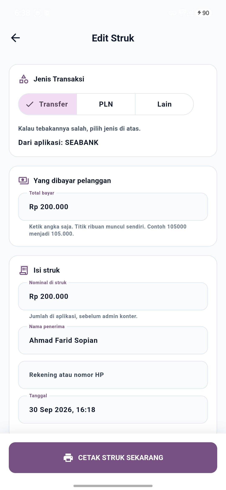
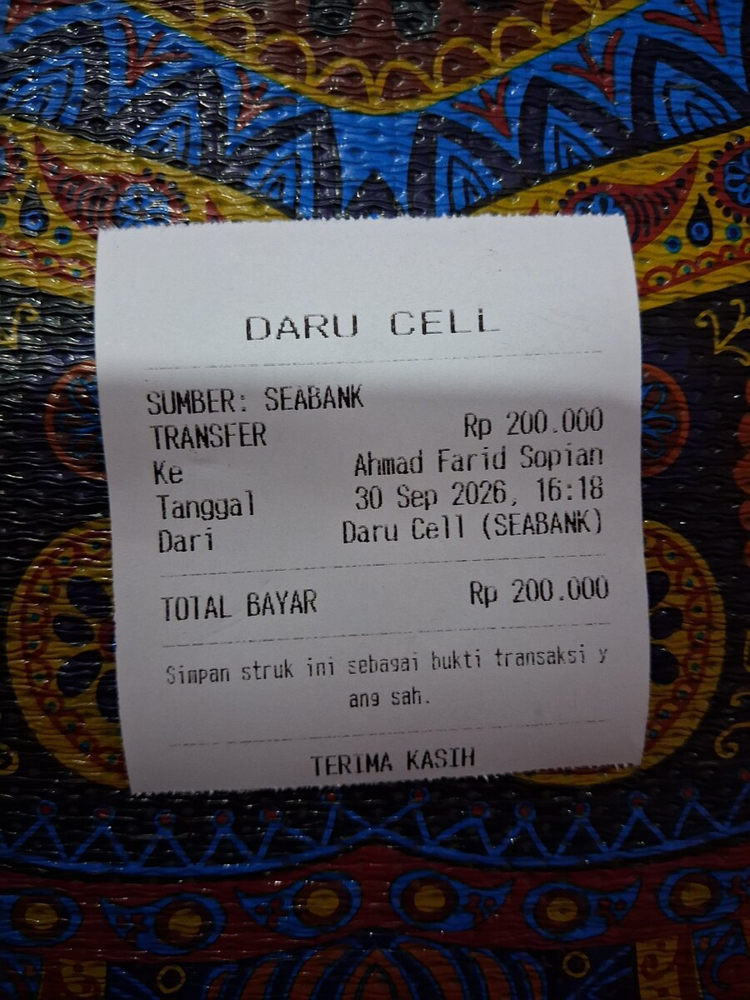

# Konter Print Helper


> **Solusi Cetak Struk Digital ke Thermal Printer dalam Sekali Klik.**

Aplikasi utilitas untuk pemilik **Konter Pulsa & PPOB**. Mengubah bukti transaksi digital (share/screenshot dari e-wallet) menjadi struk fisik yang rapi lewat OCR, form terstruktur, dan printer Bluetooth thermal.

---

## Tampilan Aplikasi

| Homepage | Edit Struk (OCR) | Setting Printer | Hasil Cetak |
|:---:|:---:|:---:|:---:|
|  |  |  |  |

Screenshot diperbarui **2026-09-30** (form Transfer/PLN/Lain + cetak SeaBank).

---

## Masalah & Solusi

| Masalah | Solusi |
| :--- | :--- |
| Cetak screenshot langsung → teks pecah/blur | OCR (Google ML Kit) → teks tajam di thermal |
| Layout e-wallet boros kertas | Template padat 58mm, hanya field penting |
| Alur save → galeri → app printer | Share Intent langsung ke Konter Print |
| Struk transfer vs PLN beda struktur | Deteksi jenis + form terstruktur (bisa dikoreksi) |
| Admin konter tidak ada di resi app | Field **Total bayar** editable (nominal + admin) |

## Fitur Unggulan

* **Direct Share Integration** — muncul di menu Bagikan Android dari e-wallet.
* **Smart OCR** — Google ML Kit Text Recognition.
* **Deteksi jenis transaksi** — Transfer / PLN Token / Lain (override manual jika salah).
* **Form terstruktur** — prefill nominal, penerima, tanggal, IDPEL, token; bukan dump teks mentah.
* **Total bayar custom** — konter isi biaya admin agar total sesuai pelanggan.
* **Token PLN** — dicetak **satu baris, ukuran besar** (20 digit).
* **Editable sebelum cetak** — koreksi OCR lewat field form.
* **Bluetooth thermal** — ESC/POS 58mm / 80mm (uji dengan RPP02N dan sejenisnya).

## Aplikasi Teruji (Supported Apps)

Parser diuji dengan sampel struk:

- [x] **DANA** — Kirim Uang (transfer)
- [x] **GoPay** — Transfer & **PLN Token**
- [x] **SeaBank** — Transfer antar bank / e-wallet
- [ ] OVO *(coming soon)*
- [ ] BRImo *(coming soon)*

## Tech Stack

* **Core:** [Flutter](https://flutter.dev) (Dart)
* **Native:** Android Share Intent
* **OCR:** [google_mlkit_text_recognition](https://pub.dev/packages/google_mlkit_text_recognition)
* **Printer:** [blue_thermal_printer](https://pub.dev/packages/blue_thermal_printer)
* **State:** Provider

## Cara Penggunaan

1. Selesaikan transaksi di e-wallet (DANA / GoPay / SeaBank, dll.).
2. Tekan **Share / Bagikan** pada bukti transaksi.
3. Pilih **Konter Print Helper** / Daru Cell.
4. App membaca OCR → isi form (Transfer / PLN / Lain).
5. Sesuaikan **Total bayar** (tambah admin jika perlu), lalu **Cetak**.

## Instalasi & Pengembangan

```bash
git clone https://github.com/Ndaru244/konter-print-helper.git
cd konter-print-helper
flutter pub get
# Device fisik disarankan untuk Bluetooth + Share Intent
flutter run
```

## Lisensi

MIT
